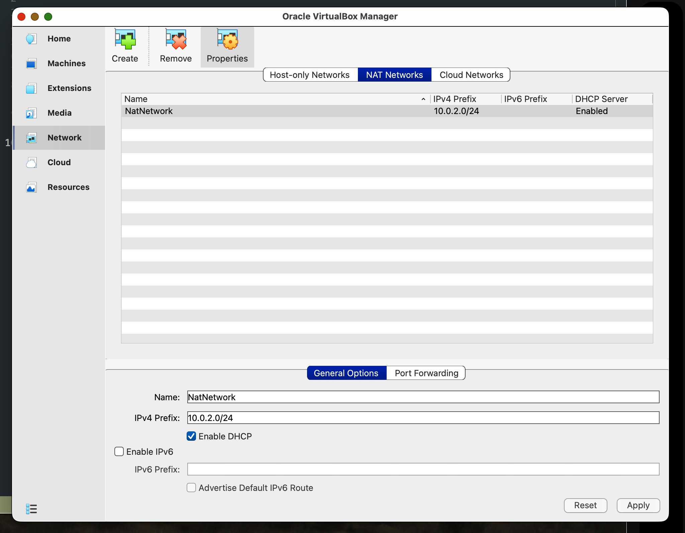

# networking-with-linux

## resources:
- [Installing Debian Server](https://www.youtube.com/watch?v=KoGK19GPIYg&t=840s)

## Configuring a NAT
- NAT = network address translation
- its used to allow communication from one network to another, including from host machine to virtual box VM
- with virtual box, by default the VM can connect to the internet through a NAT and to the host VM through a NAT. But it CANNOT (without setting up a NAT Network) connect to other VMs
- this NAT network can be created within virtual box settings UI

## SSH

- SSH = secure shell
- used to control a remote system from the command line
– you can install ssh if it isnt already installed using `apt install openssh-server`.
- virtual box adds complexity to ssh connections from the host to vm, so we need to use port forwarding

### ifconfig and ip
`ifconfig` stands for interface configuration. It displays information about your
  network interfaces, including:

  - Interface names — e.g., en0 (Wi-Fi), lo0 (loopback), eth0 (ethernet)
  - IP addresses — both IPv4 (inet) and IPv6 (inet6)
  - MAC address — (ether)
  - Status — whether the interface is up or down

It's the macOS/older Unix equivalent of `ip a` on Linux.

ip a / ifconfig show all network interfaces on your machine, which can include:

  Private (RFC 1918) addresses:
  - 10.0.0.0/8
  - 172.16.0.0/12
  - 192.168.0.0/16

  Other addresses you'll commonly see using `ip a` or `ifconfig`:
  - 127.0.0.1 / ::1 — loopback (localhost), not routable at all. Localhost is called a loopback because any traffic routing here is interepted by the OS and always 'loops back' to the local machine. The traffic never hits the NIC or router.
  - 169.254.x.x — link-local (APIPA), assigned when DHCP fails
  - fd00::/8 or fe80::/10 — IPv6 private/link-local ranges
  - A public IP — if your machine has a NIC (Network Interface Card) directly assigned a public IP (common on cloud VMs/servers, less common on home
  machines)

  Key point: On a typical home/office machine behind a router, you'll see private IPs. But on a cloud server (AWS, GCP, etc.),
  you often see a private IP on the interface even though the machine has a public IP — the public IP is handled by the cloud's
   NAT layer and won't appear in ip a at all.

  To find your *public* IP, you'd need to query an external service (e.g., curl ifconfig.me).
  - to retrieve ipv4 address specifically: `ifconfig.me -4`
  - to retrieve ipv6 specifically: `ifconfig.me -6`

### port forwarding

When data arrives at a machine on a specific port, instead of that machine handling it, it first gets forwarded to a different machine (or port).

#### Use cases:

##### Home Router

Your router has one public IP. Behind it are many devices with private IPs. From the internet, there's no way to reach a private ip directly.

Port forwarding solves this:
- Someone connects to your public IP on port 8080
- Your router sees it and forwards it to the private ip on port 80
- The server on that machine responds, router sends the reply back

##### Other common uses:
- Hosting a game server at home
- SSH-ing into a home machine from outside
- Exposing a local web server to the internet

#### SSH with VirtualBox
Ater getting the ip address of the vm, set up port forwarding on virtualbox.

- host ip should be 127.0.0.1
- host port could be anything
- guest ip is the ip address of the vm
- guest port is 22 which is the default for ssh on any machine

ssh into it using: `ssh sysadmin@<ip> where in a port forwarding case is the localhost ip. You should add the port option in this case as wel: `-p <host port specified>`

#### VIM

vim is usually installed but if not, `sudo apt install vim`.

to create and open a file using vim, `test1-vim.txt'`

Vim has diffrent 'modes'. for example, there's command mode and insert mode. to add text, you should be in insert mode. To go into insert mode from command mode, press `i`

press `esc` to get out of insert mode

use `:wq` to write save the file to the disk and quit
use `:w` to write the file to the disk
use `:q` to quit

#### TCP/IP and IP addresses

static ip addresses are manually assigned, while dynamic ip addresses are assigned automatically
- routers or switches and firewalls and printers typically have static ips. servers are often static but not always. usually its the hosts or devices that do not change often.
- devices that change often should get their ip addresses from dhcp server. that may be a standalone server or could be part of the router. dynamic assignment is quicker and less error prone.

everything in an ip address except the last placeholder is the network. the last section is the device on the network. /## at end of ip address is the net mask.

`inet` from `ip a` command means "internet address" or "ip address"

`state UP` means the network is up and running 